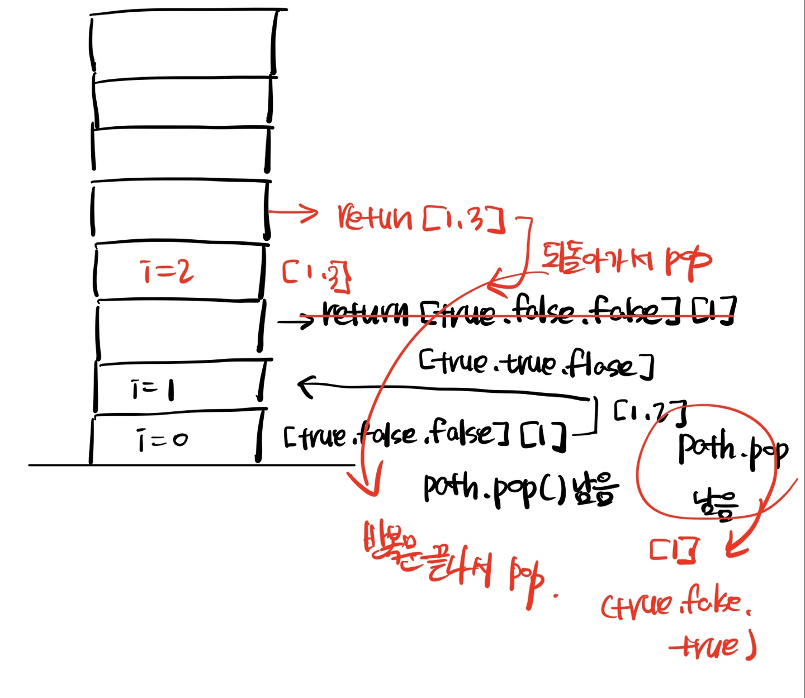
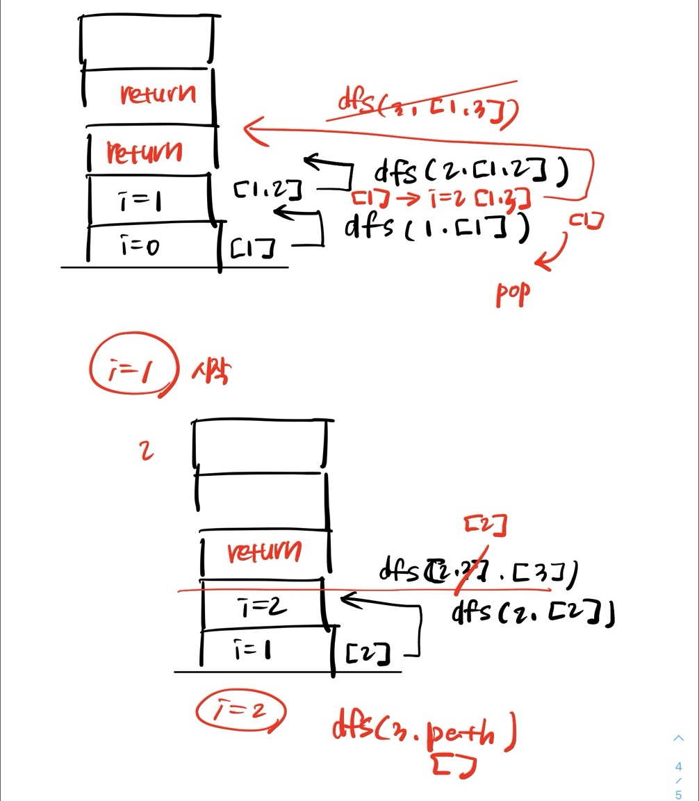

`Today I Learned` 오늘의 나

- [x] 순열/조합을 직접 DFS로 구현하며 **재귀 호출 흐름**을 깊이 이해했다
- [x] `visited`, `start` 등 중복 방지 기법을 체득했다
- [x] `최소직사각형` 문제를 DFS로 풀어보며 **이중 배열 탐색과 백트래킹의 확장성**을 연습했다
- [x] **과한 DFS 구현은 때로 오버코딩일 수 있음을 체감**했다

## 오늘의 배운 점 #TIL

- **순열(Permutation)**은 순서가 중요하므로 `visited[]` 배열을 활용해 *중복을 방지*하고,
- **조합(Combination)**은 순서가 중요하지 않으므로 `start` 인덱스를 활용해 *이전 값 재사용을 방지*한다.
```javascript
// 순열 구조
function dfs(path) {
  if (path.length === r) {
    result.push([...path]);
    return;
  }

  for (let i = 0; i < arr.length; i++) {
    if (visited[i]) continue;
    visited[i] = true;
    path.push(arr[i]);
    dfs(path);
    path.pop();
    visited[i] = false;
  }
}
```

```javascript
// 조합 구조
function dfs(start, path) {
  if (path.length === r) {
    result.push([...path]);
    return;
  }

  for (let i = start; i < arr.length; i++) {
    path.push(arr[i]);
    dfs(i + 1, path);
    path.pop();
  }
}
```
- 코드의 흐름을 이해할 수 없어 *손코딩으로 호출 스택*을 따라가며 **1줄 1줄 흐름을 직접 분석**했다 🤯
<div style="display: flex; gap: 12px;">
  
  
</div>
    
- 백트래킹 로직은 거의 모든 문제에서 동일하다.
```javascript
function dfs(path) {
  if (조건 위반) return;

  if (정답 조건) {
    정답 저장;
    return;
  }

  for (...) {
    선택
    dfs(path)
    선택 취소
  }
}
```

## 🧘 깨달은 점

- 순열과 조합의 로직을 **직접 구현**하며 단순 암기에서 벗어나 로직의 흐름을 몸에 익힐 수 있었다.
- 하지만, 실전 문제(`최소직사각형`)에서 **모든 경우를 탐색하는 DFS는 매우 비효율적**이라는 걸 체감했다👀

- 정렬을 미리 해두면 DFS의 경우의 수를 줄일 수 있지만, `O(2ⁿ)`의 백트래킹은 `sizes.length = 10,000`일 경우 **사실상 시간초과 지옥** 🔥🔥🔥
    
📌 `정렬 미적용 DFS`: 시간복잡도 `O(2^n)`  

```javascript
// DFS + 모든 가로/세로 조합 시도 (과한 계산 방식)
function dfs(depth, path) {
  if (depth === sizes.length) {
    const [w, h] = path.reduce(
      (acc, [cw, ch]) => [Math.max(acc[0], cw), Math.max(acc[1], ch)],
      [0, 0]
    );
    candidates.push(w * h);
    return;
  }

  const [a, b] = sizes[depth];
  dfs(depth + 1, [...path, [a, b]]);
  dfs(depth + 1, [...path, [b, a]]);
}
```

📌 `정렬 적용 후 DFS`: 여전히 `O(2^n)`, 다만 중복 조합 수 감소  

```javascript
const sortedSizes = sizes.map((size) => size.sort((a, b) => a - b));
// DFS + 모든 가로/세로 조합 시도 (과한 계산 방식)
function dfs(depth, path) {
  if (depth === sortedSizes.length) {
    const [w, h] = path.reduce(
      (acc, [cw, ch]) => [Math.max(acc[0], cw), Math.max(acc[1], ch)],
      [0, 0]
    );
    candidates.push(w * h);
    return;
  }

  const [a, b] = sortedSizes[depth];
  dfs(depth + 1, [...path, [a, b]]);
}
```

📌 `그리디 정렬 방식`: 시간복잡도 `O(n)`

```javascript
function solution(sizes) {
  let maxW = 0, maxH = 0;

  for (let [w, h] of sizes) {
    const [minSide, maxSide] = w < h ? [w, h] : [h, w];
    maxW = Math.max(maxW, minSide);
    maxH = Math.max(maxH, maxSide);
  }

  return maxW * maxH;
}
```

## 🎯 내일의 목표

| 학습 주제                 | 학습 목표 요약                                         |
| --------------------- | ------------------------------------------------ |
| 순열/조합 복습 + dfs 흐름 복기  | `getPermutations`, `getCombinations` 흐름 다시 따라가보기 |
| 전체 알고리즘 개념 정리<br>마인드맵 | `Obsidian`을 이용한 <br>정렬 ~ 완전탐색 ~ dfs 개념 요약        |

> 오늘은 DFS의 구조를 뼈 속까지 파헤친 날이었다  
> 내일은 이 DFS를 **다양한 문제에 직접 적용해보는 실전 응용의 날**이 될 것이다.  
> *완전탐색의 모든 뿌리는 순열/조합/DFS에 있다!👊🏻👊🏻👊🏻*