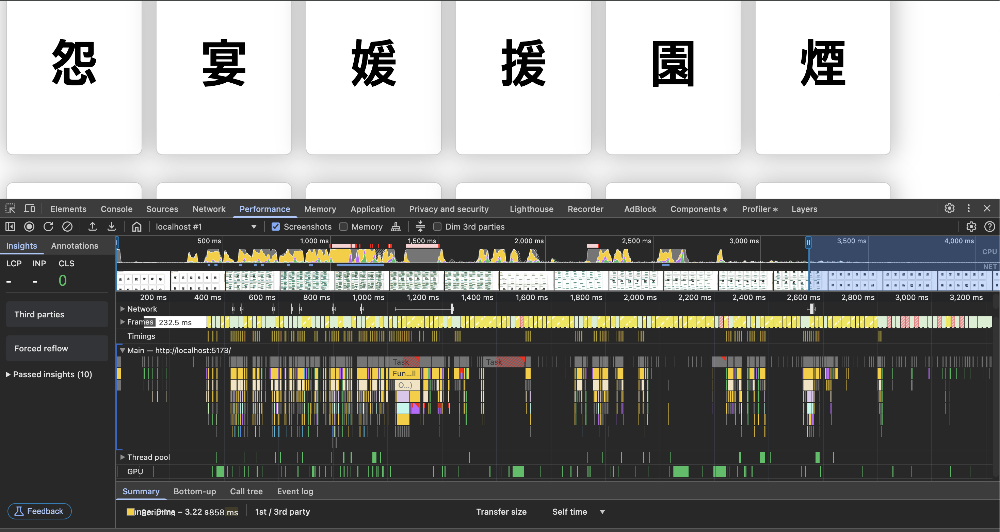
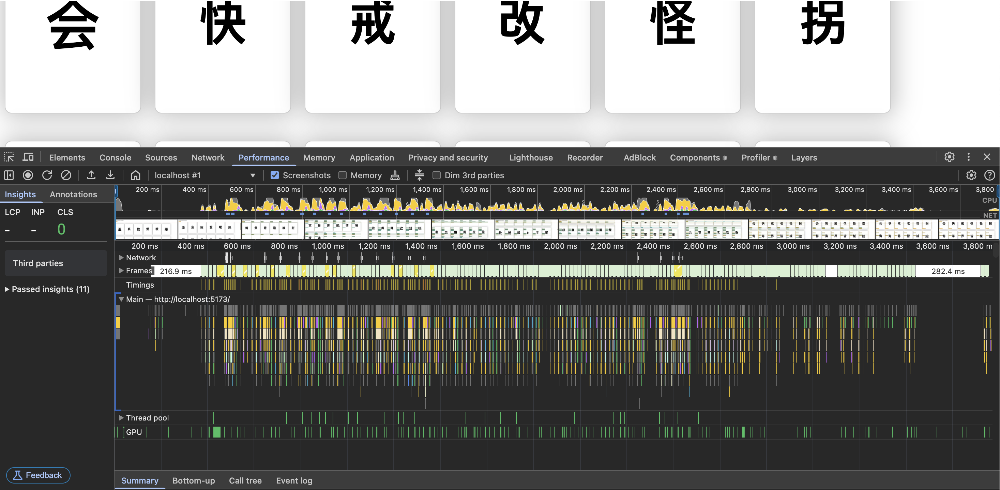

🛠️ `Dev Log` — Virtual Scroll 및 카드 렌더링 최적화

- `react-window` 도입 후 퍼포먼스 이슈 발견
	- 수 천개의 카드 데이터를 렌더링할 때 성능 문제 발생
- 카드 애니메이션(Render Delay) 개선 시도

## 왜 그랬을까?

> Virtual Scroll을 적용했음에도 오히려 성능 저하가 발생함.
> 원인을 추적해보니 애니메이션, diff 연산, resize 등에서 과도한 비용이 들고 있었음.

|                      | **IntersectionObserver 무한스크롤** | **React-window 가상 리스트**             |
| -------------------- | ------------------------------ | ----------------------------------- |
| **렌더링 방식**           | 실제 DOM을 누적하여 렌더링               | 화면에 보이는 DOM만 렌더링                    |
| **렌더 수**             | 누적되어 점점 많아짐                    | 일정 수 이하로 유지                         |
| **한 번에 처리되는 DOM 개수** | 적음 <br>*스크롤 시 1~2개 추가*         | 많음 <br>*스크롤 시 수십 개 교체*              |
| **성능 부하 방식**         | 점진적 증가 → <br>⚠️ 브라우저 최적화 수용 가능 | 순간적 폭발 → <br>⚠️ 애니메이션 겹치면 프레임 저하 가능 |
| **애니메이션**            | 리렌더 대상이 적음<br>→ 영향이 작다.        | 여러 컴포넌트가 동시에 트랜지션 <br>→ 병목 발생       |
| **장점**               | 직관적 구현<br>자연스러운 스크롤 흐름         | 렌더 DOM 수를 *효과적으로 제어 *가능             |
| **단점**               | 전체 DOM이 많아지면<br>⚠️ 성능 저하 우려    | 리렌더링 순간 비용이 높고<br>⚠️ GPU 병목 가능      |
| **적합한 경우**           | *콘텐츠 수 적거나 정적 리스트*             | *대량 데이터 & 단순 구조에서 유리*               |

## 기술 스택 및 도구

- ✅ React
- ✅  react-window
- ✅ Chrome DevTools `Performance 탭`

## 🏄 최적화 시도 

| 항목                         | 설명                                                        |
| -------------------------- | --------------------------------------------------------- |
| ✅ `React.memo()` 적용        | - `KanjiCard` 컴포넌트 렌더링 최적화<br>- `ReadingRow` 컴포넌트 렌더링 최적화 |
| ✅ `areEqual` 커스텀 비교 함수     | props 변경 없을 경우 리렌더 방지                                     |
| ✅ `will-change: transform` | CSS GPU 가속 힌트 적용                                          |
| ✅ `throttle()` 적용          | window resize 시 과도한 렌더 방지                                 |
| ✅ `key` 속성 개선              | `index` 대신 `kanji.id` 사용으로 React diff 최적화                 |
| ✅ `box-shadow` 조정          | CSS 그림자 효과를 최소화해 레이아웃 부담 완화                               |

## Performance

| 구분                            | 설명                                               | 스크린샷                           |
| ----------------------------- | ------------------------------------------------ | ------------------------------ |
| IntersectionObserver          | DOM 요소는 느리지만 한 번에 하나씩 관찰되어 비교적 안정적인 성능 유지        | ![[intersection-observer.png]] |
| Virtual Scroll 도입             | 한 번에 많은 카드들이 분할 렌더링 되면서 CPU 사용량 급증, 레이아웃 연산 증가🚨 | ![[virtual-scroll.png]]        |
| Virtual Scroll<br> - 최적화 적용 후 | 최적화 적용 → <br>프레임 안정화 / GPU 효율 향상                 | ![[virtual_optimization.png]]  |

### 최적화 결과 비교

<div style="display: flex; gap: 12px; overflow: auto; ">
  
  
</div>

| 지표              | 개선 전        | 개선 후                     |
| --------------- | ----------- | ------------------------ |
| 렌더링 DOM 수       | 약 2300개     | 화면에 보이는 50개 내외           |
| 카드 렌더 체감        | 느림 (지연/버벅임) | 부드럽고 빠름                  |
| Layout 시간 *예상*  | ~70ms 이상    | ~30ms 이하                 |
| React Re-render | 모든 카드 렌더    | 필요 시 카드만 렌더 `React.memo` |
| FPS *예상*        | 30~40fps    | 55~60fps                 |

> ※ 수치는 DevTools 기반 추정치로, 전후 체감 중심으로 작성하였습니다.

```javascript
/*
본 측정값은 실제 사용자 경험을 기반으로 한 비공식 추정치이며,  
정확한 수치 측정을 위해선 DevTools Performance 및 React Profiler 계측이 필요합니다.

추후 퍼포먼스 분석 로그와 함께 상세 문서화 예정입니다.
*/
```

## 🧘 깨달은 점

- 단순히 Virtual Scroll을 적용한다고 무조건 성능이 개선되진 않는다. #최적화 #필수
	- **렌더링 비용 해결 불충분**
	- *불필요한 props 전달 및 메모리 낭비*의 최소화가 중요🚨🚨
	
- `React.memo`, `areEqual`, `throttle`, `will-change` 조합이 꽤 강력함을 체감
	- ✅ **렌더링 Frame 안정화**
		- 초기 프레임 시간 416ms → **183ms 이하로 감소**
	- ✅ **GPU 활용 효율 증가**
	- ✅ **스크롤 중 사용자 체감 성능 향상**
	- ✅ **컴포넌트 리렌더링 최소화로 유지 보수성 상승**
	
- **React의 성능 최적화는 ‘단일 기술’로 해결되지 않는다.**
    - Virtual scroll 하나만으로는 오히려 성능이 악화될 수도 있음을 체감💦💦
    - 각 최적화 요소(`throttle`, `memo`, `key`, `layout`, `CSS`)가 유기적으로 맞물려야 한다.

- **렌더링 최적화는 체감보다 수치로 판단해야 한다.**
    - DevTools의 `FPS`, `GPU`, `Main Thread`, `Recalculate Style`, `Composite Layers` 항목 분석을 통해 정확한 병목 파악 가능.
    
## 회고

- 고성능 UI에서 단순히 가상 리스트만 도입한다고 최적화되는 것이 아니었다🤯
- 가상 리스트는... 다음 항목이 병행되어야 진가를 발휘한다.
	- ✅ 적절한 key 사용
	- ✅ 애니메이션 최적화
	- ✅ throttleling
	- ✅ 메모이제이션
- 성능 측정은 눈이 아닌 *DevTools의 FPS / Main Thread / GPU 사용량*으로 확인하는 습관을 들이자💪🏻💪🏻
- 이후에도 렌더링이 많아질 기능에 대해서는 **컴포넌트 단위의 성능 분석을 꾸준히 병행**하자!!

> 이번 렌더링 최적화 과정에서 가장 신경 쓴 부분은 `will-change`와 `React.memo`의 **위험성과 트레이드오프**를 충분히 인지하고 사용했다는 점이었다.

#### ⚠️ 위험요소를 인지하며 적용한 최적화

| 항목              | 주의점                                                          | 왜 이 상황에서 적합했는가                                                                             |
| --------------- | ------------------------------------------------------------ | ------------------------------------------------------------------------------------------ |
| **will-change** | 과도한 사용 시 GPU 리소스 과소비 및 `memory leak` 발생 가능                   | 카드 애니메이션이 핵심 UI 요소이며, `transform` 중심이므로 위험성을 감수하더라도 `GPU compositing 최적화`가 실효성이 있음         |
| **React.memo**  | prop 비교가 많아질 경우 오히려 render 비용 증가  <br>shallow comparison의 한계 | 카드 하나하나의 prop이 매우 단순 (`kanji`, `flipped` 등), 그리고 성능 병목의 주 원인이 불필요한 재렌더링이었기 때문에 확실한 이점이 있었음 |

```tip
⚠️ React.memo는 복잡한 props를 가지고 있는 컴포넌트보다는,
⚠️ 단순한 props + 자주 렌더링되는 컴포넌트에 적합하다!
```

##  Continue...
- [ ] 기술 블로그 포스팅
- [ ] 모바일 환경에서의 리소스 사용량도 체크

## 📘 참고자료
- [react-window 공식 문서](https://react-window.vercel.app/)
- [React.memo 공식 문서](https://ko.react.dev/reference/react/memo)
- [MDN - will-change](https://developer.mozilla.org/ko/docs/Web/CSS/will-change)

